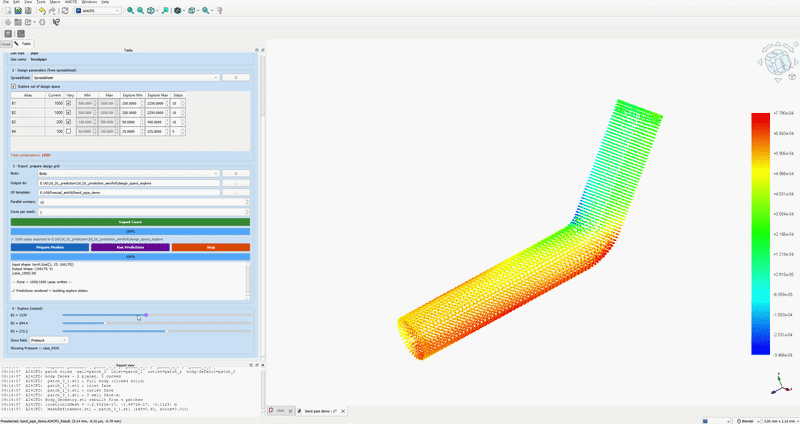

Tutorial summary:

<table>
  <tr>
    <td align="center">
      <b>Bend pipe</b> 
       
      Description here
    </td>
    <td align="center">
      <b>manifold</b> 
       
      Description here
    </td>
    <td align="center">
      <b>tank</b> 
       
      Description here
    </td>
    <td align="center">
      <b>Topic 4</b> 
       
      Description here
    </td>
  </tr>
  <tr>
    <td align="center">
      <b>Topic 5</b> 
       
      Description here
    </td>
    <td align="center">
      <b>Topic 6</b> 
       
      Description here
    </td>
    <td align="center">
      <b>Topic 7</b> 
       
      Description here
    </td>
    <td align="center">
      <b>Topic 8</b> 
       
      Description here
    </td>
  </tr>
  <tr>
    <td align="center">
      <b>Topic 9</b> 
       
      Description here
    </td>
    <td align="center">
      <b>Topic 10</b> 
       
      Description here
    </td>
    <td align="center">
      <b>Topic 11</b> 
       
      Description here
    </td>
    <td align="center">
      <b>Topic 12</b> 
       
      Description here
    </td>
  </tr>
  <tr>
    <td align="center">
      <b>Topic 13</b> 
       
      Description here
    </td>
    <td align="center">
      <b>Topic 14</b> 
       
      Description here
    </td>
    <td align="center">
      <b>Topic 15</b> 
       
      Description here
    </td>
    <td align="center">
      <b>Topic 16</b> 
       
      Description here
    </td>
  </tr>
</table>
